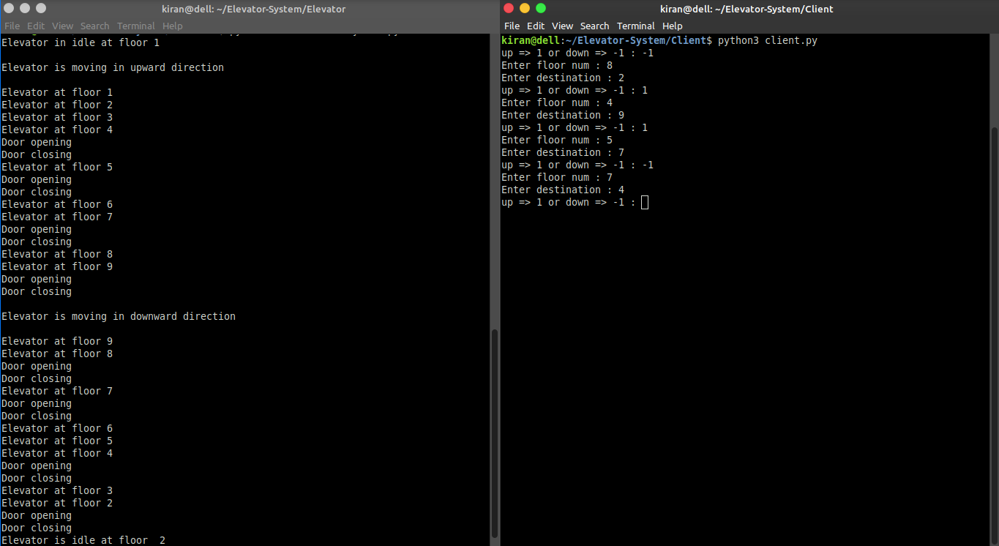
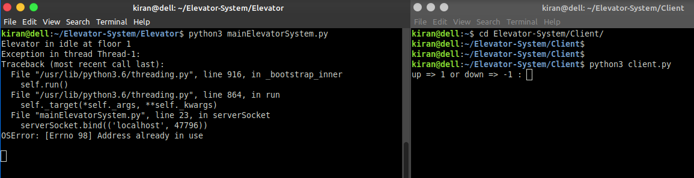
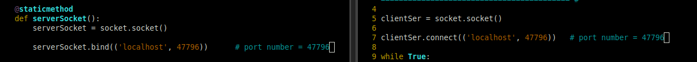

# Elevator-System

### 1.if you want to run this project, run both [mainElevatorSystem.py](https://github.com/upasek/Elevator-System/tree/main/Elevator) and [client.py](https://github.com/upasek/Elevator-System/tree/main/Client) file at a time in your system.

### 2.if you get error like : (OSError: [Errno 98] Address already in use) at the staring, so simply change the port number in both the file.

### 3.The range of port number always in between 0 to 65353.

